# **INNER FORCE** 

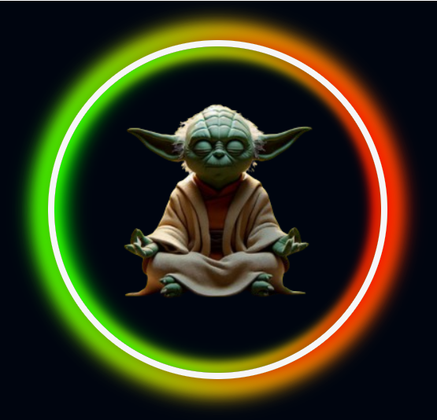

 

> "*Of the moment, be. In the moment, live. The art of remaining in the present, learn. Neither the past nor the future exists.*"
>
> Master Yoda  

 

INNER FORCE is a responsive application that immerses users in the galaxy far, far away with guided meditations, authentic Star Wars sound effects, and various meditation styles to promote inner peace and mindfulness.

Our unique meditation app harnesses the cutting-edge Hemi-Sync technology to synchronize your brainwaves and enhance your mindfulness experience. With a galaxy of guided meditations featuring beloved Star Wars characters such as Yoda, Luke Skywalker, and Rey, you'll embark on a journey to inner peace accompanied by iconic sounds from the Star Wars universe.

Deployed app can be found here: [Inner Force](https://yoda-app-48cdcbb359cb.herokuapp.com/)

 

# Table of Contents

- [Criteria](#criteria)
- [About Submission](#about-submission)
    - [Dark Side Dev's Team Goal](#dark-side-devs-team-goal)
- [Design](#design)
	- [Colours](#colours)
    - [Typography](#typography)
- [UX / UI](#UX/UI)
	- [User Stories](#user-stories)
	- [Wireframes](#wireframes)
- [Features](#features)
	- [Navigation](#navigation)
	- [Footer](#footer)
	- [Home Page](#home-page)
- [Technologies Used](#technologies-used)
	- [Languages Used](#languages-used)
	- [Frameworks, Libraries & Programs Used ](frameworks-libraries-and-programs-used)
    - [Image Credits](#image-credits)
	- [Media Credits](#media-credits)
- [The Team](#the-team)
- [Credits](#credits)

 

## Criteria
Our team addressed the following Hackathon criteria with innovative solutions:

- Project is **Star Wars** themed.
- Well-executed project with effective planning with **GitHub Projects** and a basic **README.md**.
- The project uses **Star Wars sound effects**.  
- Project demonstrates **responsiveness**, **accessibility**, and thorough **testing**.
- Fun and entertaining **presentation**.  
 

# **ABOUT SUBMISSION**
 

## **'Dark Side Devs' Team Goal**
We aim to:
- Develop engaging guided meditations and immersive Star Wars soundscapes to help users achieve greater mindfulness and relaxation.
- Leverage authentic Star Wars sound effects and themes to offer a unique, captivating meditation experience that appeals to both Star Wars fans and meditation practitioners.
- Build a user-friendly interface that makes it simple for users of all experience levels to navigate the app and benefit from its various meditation styles and features.
- Continuously improve app performance, ensuring smooth, bug-free operation to provide a reliable and seamless user experience.

## **DESIGN**

### **Colours**

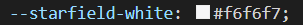
 
A soft, almost pure white, suggesting the shimmering stars in the night sky.

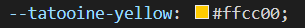
 
A bright, warm yellow, evoking the golden sands and twin suns of Tatooine.

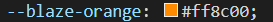
 
A vibrant, fiery orange, symbolizing the intense heat and energy of a blazing star.

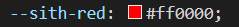
 
A bold, intense red, representing the power and menace of the Sith.

 
A cool, luminous cyan, capturing the futuristic glow of holographic displays.

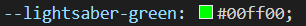
 
A striking, neon green, inspired by the iconic color of a Jedi's lightsaber.

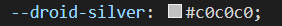
 
A sleek, metallic silver, reflecting the polished exterior of advanced droids.

 
A dark, charcoal grey, representing the emptiness and depth of the void.

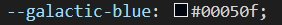
 
A deep, almost black-blue, reminiscent of the vast and mysterious outer space.

  
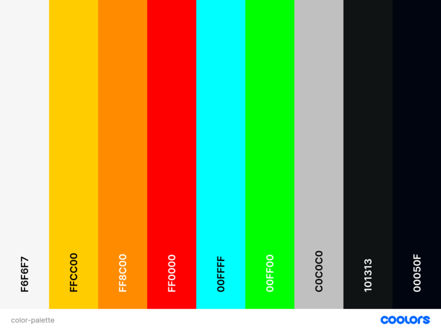
  
### **Typography**

All fonts used throughout the application were sourced from [Google Fonts](https://fonts.google.com/).

#### **'Climate Crisis' Font**
- Used for: INNER FORCE logo and headings, as well as IF favicon
- Climate Crisis delivers a bold, impactful aesthetic reminiscent of traditional Star Wars title sequences, therefore we strategically used it to draw the users attention to important elements, such as our logo and key headings. This font adds an engaging and thematic element to the app aesthetics, without compromising accessibility. 
  

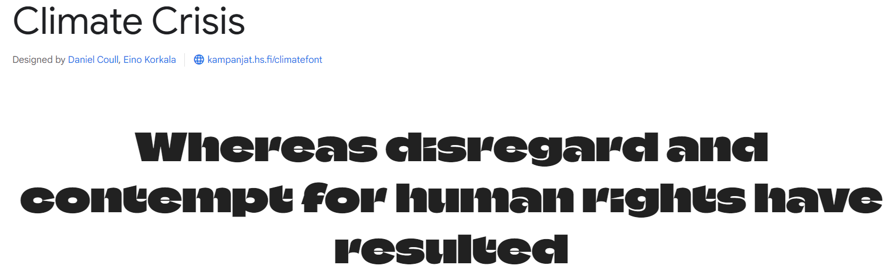
  

#### **'Share Tech Mono' Font**
- Used for: all other text within application
-  The monospaced nature of Share Tech Mono ensures clarity and readability, which is essential for our meditation instructions and navigation menus, thus fostering an intuitive user experience. The font also has a sleek, modern typeface reminiscent of futuristic controls and interfaces  thereby seamlessly aligning with the sci-fi aesthetic of the Star Wars universe and enhancing immersion for our users.
  

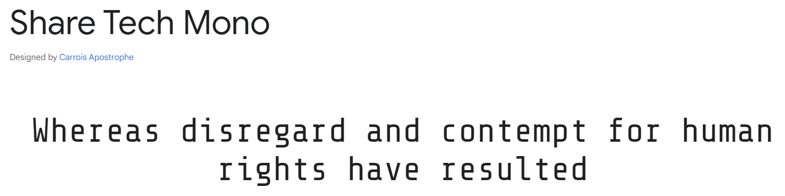
  

## **UX / UI**

### **User Stories**

As a part of development we used Github Kanban board with user stories, EPICS and MoSCoW method. While we were not perfect using it (because noone is, right), it was a crucial way to keep track on user stories and stay in our galaxy. Days were long and nights were quiet, both full of force, excitement and coffee.   Github board can be accessed here: [Github Kanban board](https://github.com/users/violaberg/projects/7)

All user stories can be found here: [Github user stories](https://github.com/violaberg/star-wars-hackathon-2024/issues?q=is%3Aissue+is%3Aclosed)

As a new user:
- I can create an account so that I can save my progress and access personalized features
- I can contact the admin for support or feedback so that I can get help with issues or suggest improvements for the app
- I can learn about the creators and purpose of the app so that I can understand the mission and the team behind the app
- I can find privacy policy so that I can understand how my personal data is collected, used, and protected
- I can access a list of frequently asked questions so that I can received benefit
- I want a navigation menu on every page so that I can navigate easily to other parts of the application
- I can navigate back to the home page and visit other social websites so that I can visit other websites related to Star Wars and also can switch to the home page rapidly
- I want to to access a README file so that I can see and understand what this project is about, gain clarity and understand the purpose of this website.
- I can view a list of available guided meditations so that I can choose a session that fits my needs
- I can set to receive daily reminders or notifications so that I can maintain a regular meditation practice
- I can browse and select meditation sessions so that I can choose the one that fits my current needs and mood
- I can have a seamless guided meditation experience so that I can fully immerse myself in the session without distractions
-  I can access Star Wars music tailored for different meditation events so that I can enhance my meditation experience with thematic music
  
- As a returning user:
 I can log in to my account so that I can continue my meditation practice from where I left off

### **Wireframes**

  
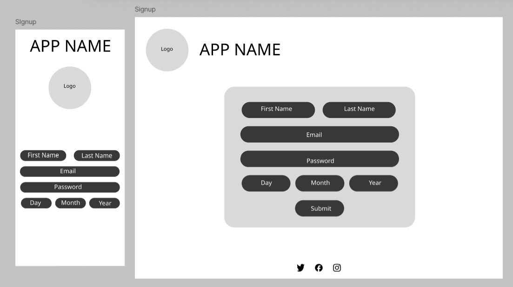
  
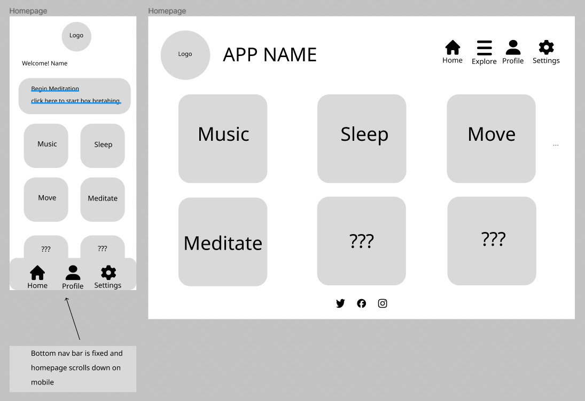
  

## **FEATURES**

### **Navigation**

### **Footer**

The 'Footer' section is consistent with the app branding and colour scheme and provides users with important information that is easily accessible. The inclusion of elements such as a copyright notice, privacy policy, FAQ's and a call to action aligns with the app's theme and adds a delightful touch for users.

 The copyright notice indicates ownership and protection of intellectual property, which in this case identifies the copyright owner: 2024 INNER FORCE. Including the year 2024 reflects the character of the company by informing users that all content is up to date and that there is an active approach to the app development.

The privacy policy is essential to transparently inform users about data handling practices and reassure them of their personal information's confidentiality in a galaxy far, far away.

FAQ's (Frequently Asked Questions) serve to help users navigate the Force-driven journey by providing answers to common questions (e.g. How Can I Use The INNER FORCE App?) and enhancing their overall user experience.

 Lastly, the social media links (Facebook, Instagram, YouTube, Spotify) act as a call to action which encourage users to engage further with the app's content on wider platforms and fosters a sense of exploration and enjoyment.

Overall, the 'Footer' section was thoughtfully crafted to not only provide important information but also to enhance the user experience by staying true to the app's theme and engaging users in a playful and immersive manner.

 

### **Home Page**

## TECHNOLOGIES USED

### Languages Used
- 
- 
- 
- 

 ## Frameworks, Libraries & Programs Used

- - GitHub is a web-based platform for version control using Git, enabling collaborative software development and hosting of code repositories. GitHub connects to GitPod and Heroku. 

-  – Connected to GitHub, GitPod hosted the coding space, allowing the project to be built and then committed to the GitHub repository. Used for version control. 

-  - Connected to the GitHub repository, Heroku is a cloud application platform used to deploy this project so the backend language can be utilised/tested. Used for hosting the deployed back-end site.

-  - Django is a high-level web framework for building web applications rapidly with a clean and pragmatic design. Used as the Python framework for the site.

-  - Bootstrap is a front-end framework for developing responsive and mobile-first websites quickly and efficiently. Utilised for modern responsiveness and pre-built components.

- - Cloudinary is a cloud-based media management platform that offers solutions for storing, optimising, and delivering images and videos for web and mobile applications. 

-  - Summernote is a Django app that enables users to easily integrate a rich text editor into their web applications, enhancing event creation and description functionality. 

-  - Microsoft ClipChamp is a powerful video editing tool that offers a seamless and user-friendly editing experience. Used for video editing.

-  - TinyPNG is a website that offers image compression services to optimise image files for faster loading on webpages while maintaining visual quality. Used to Compress the images.

-  - Google Fonts is a collection of free, open-source fonts that can be easily integrated into websites and other digital projects to enhance typography. Imported for fonts.

-  - Beautify is a code formatter tool that automatically formats code to improve readability and consistency. Used in Gitpod to help color code and spot errors.

-  - Figma is a wireframing tool used for creating low-fidelity mockups of user interfaces, allowing for quick and easy visualisation of design ideas. used for my wireframes.

-  - Am I Responsive is a web tool that allows users to quickly preview how their website appears on various devices and screen sises, helping to ensure responsiveness and compatibility across platforms. Put my heroku url to check responsivity to all devices.

-  - Coolors.co is a online platform for creating and exploring color palettes for design projects. Used to create a Star Wars themed color palette for our application.

-  - Tool used for generating a privacy policy for use on websites and application.

-  - Diffchecker is a text comparison tool used to highlight the differences between two blocks of text, facilitating comparison and analysis. Update my code against old code for validation.

-  - The W3C CSS Validator is a tool used to check the validity and syntax of CSS code, ensuring compliance with web standards set by the World Wide Web Consortium (W3C). Import my CSS for validation.

-  - The W3C Markup Validator is a tool used to check the validity and syntax of HTML code, ensuring compliance with web standards set by the World Wide Web Consortium (W3C). Import my html for validation.

## Image Credits

Image Credits:
- https://www.linkedin.com/pulse/silva-method-rehan-siddiqui/ (The Silva Method)
- https://www.danvilleyogawellnesscenter.com/qigong-moving-meditation (Qigong)
- https://youtu.be/HOFq3ruef7I?si=3gEBUTjyMwuFQjNV (The Gateway Experience)
- https://networkmagazine.ie/articles/alexander-technique-way-life (Alexander Techniques)
- https://blog.mindvalley.com/quantum-jumping/ (Quantum Jumping)
- https://www.linkedin.com/pulse/water-frequency-effects-has-your-health-crystal-sun/ (Sound Meditations)

## Media Credits

Media Credits:

- https://www.youtube.com/watch?v=ZY_PmJX6dAo (Starry Sky Background).
- https://www.youtube.com/watch?v=l-1ZrU6avzI (Breathing Circle Animation from Traversy Media)
- https://wallpapers.com/wallpapers/star-wars-3440x1440-2uf5to0h0yrjwcdy/download (Star Wars Wallpaper)
- https://www.chosic.com/free-music/all/ (Music)
- https://purrplecat.com/ (Music)
- https://pixabay.com/sound-effects/search/star-wars (Star Wars Sound Effects)

 

## **The Team**

Viola Bergere - SCRUM Master
[LinkedIn](https://www.linkedin.com/in/viola-bergere-5a668699/) | [GitHub](https://github.com/violaberg)

Fernando Goncalves
[LinkedIn](https://www.linkedin.com/in/fernando-goncalves2202/) | [GitHub](https://github.com/Goncalves95)

Samuel Anderson
[LinkedIn](https://www.linkedin.com/in/samuel-anderson-codes/) | [GitHub](https://github.com/samuelandersoncodes)

Muhammad Bilal
[LinkedIn](https://www.linkedin.com/in/muhammad-bilal-91a1869a/) | [GitHub](https://github.com/MBilalQureshi)

Amanda Mascurine
[LinkedIn](https://www.linkedin.com/in/amanda-mascurine/) | [GitHub](https://github.com/AmandaCIdev)

Kati Molnar
[LinkedIn]([https://www.linkedin.com/in/katalin-molnar-b6a694165/]) | [GitHub](https://github.com/molnarlin)

Katarina Nadia
[LinkedIn](https://linkedin.com/k-nadia) | [GitHub](https://github.com/k-nadia)

Craig Allen
[LinkedIn](https://www.linkedin.com/in/craig-allen-dev/) | [GitHub](https://github.com/craigallendev)

## Credits
Special thanks to:

- **CodeInstitute** for organizing the Hackathon.

