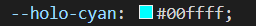

# **INNER FORCE** 

 

> "*Of the moment, be. In the moment, live. The art of remaining in the present, learn. Neither the past nor the future exists.*"
>
> Master Yoda  

 

INNER FORCE is a responsive application that immerses users in the galaxy far, far away with guided meditations, authentic Star Wars sound effects, and various meditation styles to promote inner peace and mindfulness.

Our unique meditation app harnesses the cutting-edge Hemi-Sync technology to synchronize your brainwaves and enhance your mindfulness experience. With a galaxy of guided meditations featuring beloved Star Wars characters such as Yoda, Luke Skywalker, and Rey, you'll embark on a journey to inner peace accompanied by iconic sounds from the Star Wars universe.

## Criteria
Our team addressed the following Hackathon criteria with innovative solutions:

- Project is **Star Wars** themed.
- Well-executed project with effective planning with **GitHub Projects** and a basic **README.md**.
- The project uses **Star Wars sound effects**.  
- Project demonstrates **responsiveness**, **accessibility**, and thorough **testing**.
- Fun and entertaining **presentation**.  

# **ABOUT SUBMISSION**

## **'Dark Side Devs' Team Goal**
We aim to:
- Develop engaging guided meditations and immersive Star Wars soundscapes to help users achieve greater mindfulness and relaxation.
- Leverage authentic Star Wars sound effects and themes to offer a unique, captivating meditation experience that appeals to both Star Wars fans and meditation practitioners.
- Build a user-friendly interface that makes it simple for users of all experience levels to navigate the app and benefit from its various meditation styles and features.
- Continuously improve app performance, ensuring smooth, bug-free operation to provide a reliable and seamless user experience.

 

## **DESIGN**

### **Colours**

 
A soft, almost pure white, suggesting the shimmering stars in the night sky.

 
A bright, warm yellow, evoking the golden sands and twin suns of Tatooine.

 
A vibrant, fiery orange, symbolizing the intense heat and energy of a blazing star.

 
A bold, intense red, representing the power and menace of the Sith.

 
A cool, luminous cyan, capturing the futuristic glow of holographic displays.

 
A striking, neon green, inspired by the iconic color of a Jedi's lightsaber.

 
A sleek, metallic silver, reflecting the polished exterior of advanced droids.

 
A dark, charcoal grey, representing the emptiness and depth of the void.

 
A deep, almost black-blue, reminiscent of the vast and mysterious outer space.

  

  
### **Typography**

All fonts used throughout the application were sourced from [Google Fonts](https://fonts.google.com/).

#### **'Climate Crisis' Font**
- Used for: INNER FORCE logo and headings, as well as IF favicon
- Climate Crisis delivers a bold, impactful aesthetic reminiscent of traditional Star Wars title sequences, therefore we strategically used it to draw the users attention to important elements, such as our logo and key headings. This font adds an engaging and thematic element to the app aesthetics, without compromising accessibility. 
  

  

#### **'Share Tech Mono' Font**
- Used for: all other text within application
-  The monospaced nature of Share Tech Mono ensures clarity and readability, which is essential for our meditation instructions and navigation menus, thus fostering an intuitive user experience. The font also has a sleek, modern typeface reminiscent of futuristic controls and interfaces  thereby seamlessly aligning with the sci-fi aesthetic of the Star Wars universe and enhancing immersion for our users.
  

  

## **UX / UI**

### **User Stories**

As a new user:
- I can create an account so that I can save my progress and access personalized features
- I can contact the admin for support or feedback so that I can get help with issues or suggest improvements for the app
- I can learn about the creators and purpose of the app so that I can understand the mission and the team behind the app
- I can find privacy policy so that I can understand how my personal data is collected, used, and protected
- I can access a list of frequently asked questions so that I can received benefit
- I want a navigation menu on every page so that I can navigate easily to other parts of the application
- I can navigate back to the home page and visit other social websites so that I can visit other websites related to Star Wars and also can switch to the home page rapidly
- I want to to access a README file so that I can see and understand what this project is about, gain clarity and understand the purpose of this website.
- I can view a list of available guided meditations so that I can choose a session that fits my needs
- I can set to receive daily reminders or notifications so that I can maintain a regular meditation practice
- I can browse and select meditation sessions so that I can choose the one that fits my current needs and mood
- I can have a seamless guided meditation experience so that I can fully immerse myself in the session without distractions
-  I can access Star Wars music tailored for different meditation events so that I can enhance my meditation experience with thematic music
  
As a returning user:
 - I can log in to my account so that I can continue my meditation practice from where I left off

### **Wireframes**

  

  

  

## **FEATURES**

### **Navigation**

### **Mobile Navigation**

### **Footer**

### **Home Page**

## **TESTING**

## **Technologies Used**

* Django
* Python
* JavaScript
* Bootstrap
* HTML
* CSS

## **The Team**

Viola Bergere - SCRUM Master
[LinkedIn](https://www.linkedin.com/in/viola-bergere-5a668699/) | [GitHub](https://github.com/violaberg)

Fernando Goncalves
[LinkedIn](https://www.linkedin.com/in/fernando-goncalves2202/) | [GitHub](https://github.com/Goncalves95)

Samuel Anderson
[LinkedIn](https://www.linkedin.com/in/samuel-anderson-codes/) | [GitHub](https://github.com/samuelandersoncodes)

Muhammad Bilal
[LinkedIn](https://www.linkedin.com/in/muhammad-bilal-91a1869a/) | [GitHub](https://github.com/MBilalQureshi)

Amanda Mascurine
[LinkedIn](https://www.linkedin.com/in/amanda-mascurine/) | [GitHub](https://github.com/AmandaCIdev)

Kati Molnar
[LinkedIn](https://www.linkedin.com) | [GitHub](https://github.com/molnarlin)

Katarina Nadia
[LinkedIn](https://linkedin.com/k-nadia) | [GitHub](https://github.com/k-nadia)

Craig Allen
[LinkedIn](https://www.linkedin.com/in/craig-allen-dev/) | [GitHub](https://github.com/craigallendev)

## Credits
Special thanks to:

- **CodeInstitute** for organizing the Hackathon.

[def]: images/AmIResponsive-PLACEHOLDER.png